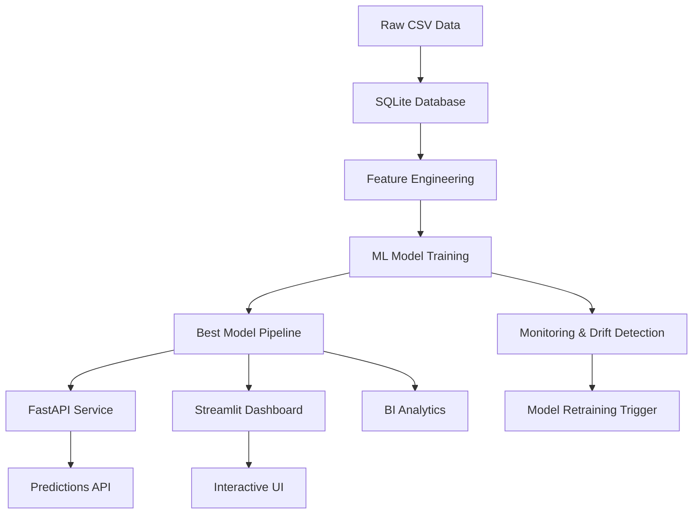

# Customer Churn Analytics - System Architecture

## Overview

This is a production-grade, end-to-end Customer Churn Prediction and Retention Analytics system designed for a B2C SaaS/OTT/Telecom business. The architecture follows MLOps best practices with data generation, model training, API deployment, monitoring, and testing.

---

## System Components



---

## Architecture Layers

### 1. **Data Layer**
- **Raw Data**: CSV files generated with realistic business rules
- **Database**: SQLite (`churn.db`) with indexed tables
- **Processed Data**: Cleaned, feature-engineered ML-ready datasets

**Files**:
- `data/raw/*.csv`
- `churn.db`
- `data/processed/*.csv`

---

### 2. **Feature Engineering Layer**
- **SQL Aggregations**: 30-day rolling windows using CTEs
- **Interaction Features**: `sessions_per_crash`, `payment_failure_rate`
- **Log Transforms**: For skewed distributions
- **Preprocessing Pipeline**: `ColumnTransformer` with scaling and encoding

**Files**:
- `src/build_features_sql.py`
- `src/features.py`

---

### 3. **Model Training Layer**
- **Models**: Logistic Regression, Random Forest, Gradient Boosting, XGBoost
- **Evaluation**: ROC-AUC, Precision, Recall, F1-Score
- **Threshold Tuning**: Optimize F1-score
- **Model Selection**: Best performing model saved as pickle

**Files**:
- `src/train_models.py`
- `src/evaluate.py`
- `outputs/models/best_model.pkl`

---

### 4. **Explainability & Segmentation Layer**
- **Global Explainability**: Feature importance from model
- **Local Explainability**: SHAP values per customer
- **Segmentation**: K-Means clustering (k=4) on behavioral features
- **Retention Strategy**: Rule-based recommendation engine

**Files**:
- `src/explain.py`
- `src/segmentation.py`
- `src/retention_strategy.py`

---

### 5. **API Layer (FastAPI)**
- **Endpoints**:
  - `GET /health`: Health check
  - `POST /predict`: Single customer prediction
  - `POST /batch_predict`: Batch predictions
- **Validation**: Pydantic schemas
- **Server**: Uvicorn ASGI server

**Files**:
- `app/main.py`
- `app/schemas.py`
- `app/utils.py`

---

### 6. **Web Application Layer (Streamlit)**
- **Pages**:
  - Home: Project overview
  - Single Prediction: Form-based prediction
  - Batch Prediction: CSV upload/download
  - Analytics Dashboard: Churn insights visualizations
- **Integration**: Calls FastAPI for predictions

**Files**:
- `streamlit_app/Home.py`
- `streamlit_app/pages/*.py`

---

### 7. **BI Layer**
- **Dataset**: Merged analytics data for Tableau/Power BI
- **KPIs**: Churn rate, revenue at risk, risk buckets, CLV
- **Dashboard**: Wireframe for executive dashboard

**Files**:
- `bi/tableau_ready_dataset.csv`
- `bi/churn_kpis.md`
- `bi/dashboard_wireframe.md`

---

### 8. **Monitoring Layer**
- **Baseline Statistics**: Generated from training data
- **Drift Detection**: Population Stability Index (PSI)
- **Prediction Logging**: Daily batch predictions
- **Metrics Tracking**: Performance monitoring

**Files**:
- `monitoring/monitor.py`
- `monitoring/drift.py`
- `monitoring/baseline_stats.json`

---

### 9. **Testing & QA Layer**
- **Data Quality Tests**: Schema, constraints, business rules
- **API Tests**: Endpoint validation, error handling
- **Model Tests**: Inference, performance thresholds
- **Data Contract**: Schema enforcement

**Files**:
- `tests/test_data_quality.py`
- `tests/test_api.py`
- `tests/test_model_inference.py`
- `src/data_contract.py`

---

## Data Flow

### Training Flow
```
1. generate_dataset.py
   ↓
2. src/db_setup.py → churn.db
   ↓
3. src/load_to_sqlite.py → Load CSVs
   ↓
4. src/build_final_dataset.py → ML dataset
   ↓
5. src/preprocess.py → Clean data
   ↓
6. src/features.py → Feature engineering
   ↓
7. src/train_models.py → best_model.pkl
   ↓
8. src/explain.py, src/segmentation.py
   ↓
9. monitoring/monitor.py → baseline_stats.json
```

### Inference Flow
```
User Input → Streamlit UI
            ↓
         POST /predict (FastAPI)
            ↓
         app/utils.py (Feature Engineering)
            ↓
         best_model.pkl (Prediction)
            ↓
         JSON Response
            ↓
         Streamlit Display + Retention Recommendation
```

---

## Technology Stack

| Layer | Technology |
|-------|-----------|
| Data Generation | `pandas`, `numpy` |
| Database | SQLite |
| ML Framework | `scikit-learn`, `xgboost` |
| API | `FastAPI`, `Uvicorn` |
| Web App | `Streamlit` |
| Visualization | `matplotlib`, `plotly` |
| Testing | `pytest` |
| Monitoring | PSI (custom implementation) |
| BI | Tableau/Power BI |

---

## Deployment Architecture

### Local Development
```
Terminal 1: uvicorn app.main:app --reload
Terminal 2: streamlit run streamlit_app/Home.py
```

### Production (Conceptual)
```
┌─────────────────────────────────────┐
│         Load Balancer               │
└──────────────┬──────────────────────┘
               │
     ┌─────────┴─────────┐
     ▼                   ▼
┌─────────┐         ┌─────────┐
│ FastAPI │         │ FastAPI │
│ Instance│         │ Instance│
└────┬────┘         └────┬────┘
     │                   │
     └────────┬──────────┘
              ▼
        ┌──────────┐
        │  S3/Cloud│
        │  Storage │
        │ (Model)  │
        └──────────┘
```

**Streamlit**: Deployed separately on Streamlit Cloud or Docker

**Database**: Migrate to PostgreSQL/MySQL for production

**Model Storage**: Cloud storage (S3, GCS) with versioning

---

## Security Considerations

1. **API Authentication**: Add API keys in production
2. **Rate Limiting**: Prevent abuse
3. **Input Validation**: Pydantic schemas enforce strict validation
4. **Data Privacy**: Anonymize customer IDs
5. **HTTPS**: Use SSL/TLS in production

---

## Scalability

1. **Horizontal Scaling**: Multiple FastAPI instances behind load balancer
2. **Caching**: Redis for frequent predictions
3. **Batch Processing**: Async job queue (Celery) for large batches
4. **Database**: Sharding/read replicas for high traffic

---

## Monitoring & Alerting

1. **PSI Monitoring**: Track data drift weekly
2. **Model Performance**: Track accuracy, precision, recall over time
3. **API Metrics**: Response time, error rates
4. **Alerts**: Slack/email notifications for:
   - PSI > 0.2 (drift detected)
   - Model accuracy < 70%
   - API downtime

---

## Future Enhancements

1. **Real-time Predictions**: Streaming data with Kafka
2. **A/B Testing**: Test retention strategies
3. **Automated Retraining**: Trigger retraining on drift
4. **Advanced Explainability**: LIME, Anchor
5. **Multi-Model Ensemble**: Combine multiple models
6. **Customer Lifetime Value**: Predict CLV alongside churn
